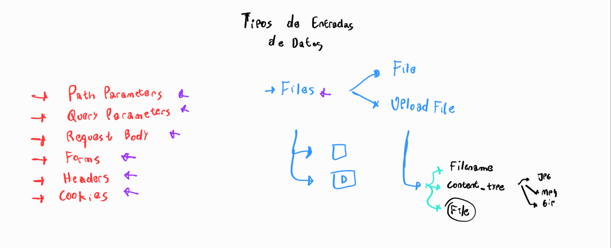

# doc-python-fastApi
Curso de FastAPi
[**doc_**](https://hackmd.io/@duvanbotello/rk8vjxCrt#Validaciones-Query-Parameters)

FastApi implementa starlette, uvicorn, pydantic que son grandes frameworks y librerias en python.
Y les agrega mejoras.

Para comenzar debemos crear un entorno de desarrollo utilizando poetry o bien pip.

### pip y venv
```

py -m venv venv
.\venv\Scripts\activate
(venv) PS D:\CURSOS\doc-python-fastApi> deactivate   

pip install fastapi uvicorn
```

### poetry 

```
# https://python-poetry.org/docs/
poetry add fastapi uvicorn
```


Para empezar con fastapi debemos importar e instanciar, una vez realizado vamos a utilizra las path operations 

```
from fastapi import FastAPI
app = FastAPI()

@app.get("/")
def get_function():
    return "Hellow Word", 200
```

para ejecutar el server debemos ejecutar el siguiente comenado
`uvicorn main:app --reload`

el flag --reaload configura el server en [Hot Realoading](https://www.geeksforgeeks.org/difference-between-hot-reloading-and-live-reloading-in-react-native/)

```
$ uvicorn main:app --reload
INFO:     Will watch for changes in these directories: ['/Users/dacerbo/Desktop/RPS/doc-python-fastApi']
INFO:     Uvicorn running on http://127.0.0.1:8000 (Press CTRL+C to quit)
INFO:     Started reloader process [80257] using StatReload
INFO:     Started server process [80259]
INFO:     Waiting for application startup.
INFO:     Application startup complete.
INFO:     127.0.0.1:63284 - "GET / HTTP/1.1" 200 OK
```

---

FastAPi implementa de base la documentacion de las API utilizando la especificacion de OAP
para poder acceder a la documentacion basta con ir al endpoint /docs `http://127.0.0.1:8000/docs`

Para consultar la especificación podemos hacerlo en el siguiente [LINK](http://127.0.0.1:8000/openapi.json)
> La especificación seria la definición de como funciona y queremos mostrar la documentación
```
// 20230131085752
// http://127.0.0.1:8000/openapi.json

{
  "openapi": "3.0.2",
  "info": {
    "title": "FastAPI",
    "version": "0.1.0"
  },
  "paths": {
    "/": {
      "get": {
        "summary": "Home",
        "operationId": "home__get",
        "responses": {
          "200": {
            "description": "Successful Response",
            "content": {
              "application/json": {
                "schema": {
                  
                }
              }
            }
          }
        }
      }
    }
  }
}
```

En FastApi tenemos Swagger UI y ReDoc, pero si tomamos la especificación la vamos a poder importar a otras plataformas de visualización.

**Para visualizar la documentacion con redoc podemos hacerlo a traves del link:** `http://127.0.0.1:8000/redoc`

---
### PATH OPERATION
path operation comprende a todo lo que viene 

### PATH PARAMETERs

### PATH, PARAMETERs, + Query Parameters


--- 
Si algún parametro es obligatorio debe ser un path parameter..
en caso de no ser obligatorio es un query parameter

> Query parametres restricciones:

````
ge -> greater or equal than >=
le -> less or equal than <=
gt -> greater than >
lt -> less than <

max_legth=int
min_legth=int
regex="pattern"

````
Mejorar la visibilidad de los parametros en la doc automatica

Title,
Description (Sirven para acompañar la documentación.)

Typos de datos para validación [**LINK**](https://docs.pydantic.dev/usage/types/#pydantic-types)


## FORM 
````commandline
poetry add python-multipart
poetry add pydantic[email]
````

### Files

[Files -> FastApi](https://fastapi.tiangolo.com/tutorial/request-files/)


#### Tipos de entradas de datos en FastAPI:

- Path Parameters -> URL y obligatorios
- Query Parameters -> URL y opcionales
- Request Body -> JSON
- Formularios -> Campos en el frontend
- Headers -> Cabeceras HTTP que pueden ser de cliente a servidor y viceversa
- Cookies -> Almacenan información
- Files -> Archivos como imágenes, audio, vídeo, etc.
Para manejar archivos con FastAPI necesitamos de las clases ‘File’ y ‘Upload File’.

#### Upload file tiene 3 parámetros:

- Filename -> Nombre del archivo
- Content_Type -> Tipo de archivo
- File -> El archivo en sí mismo





# Ordenamiento de importacion 


````commandline
COMENTARIOS:

https://pycqa.github.io/isort/
https://peps.python.org/pep-0008/

Les recomiendo utilizar isort, es comun usarlo en entornos laborales, 
se puede configurar en lo editores de codigo junto a un formateador de codigo y un linter 
y le delegas al software la habilidad de cumplir con pep8.

Les dejo un articulo que les puede servir: Setup Black and Isort in VSCode
````


# Deprecar una pieza de código sucede cuando:

Se encuentra un mejor método mas eficiente para resolver un problema que nosotros ya tenemos. Lo que hacemos no es eliminar dicho método si no la dejamos sin efecto. Para aprovechar el código posteriormente si lo requerimos nuevamente.
Una funcionalidad diferente de nuestro código a la que ya tenemos definidos.
Cuando se esta realizando una refactorización profunda del código, debido a que no tiene las mejores practicas, se define deprecar las path operation que se tienen por otras nuevas y se reemplazan. Nota: Siempre es mejor mantener el código que modificarlo desde cero.

Dentro del path operation decoratior colocamos un parametro llado: ``deprecated=True``
De esta forma ya queda deprecado el endpoint.

```
@app.get(
    path='/person/detail',
    status_code=status.HTTP_200_OK,
    tags=["Persons"],
    deprecated=True
)
def show_person(
        name: Optional[str] = Query(
            default=None,
            min_length=1,
            max_length=50,
            regex="^[a-zA-Z]*$",
            title="Person Name",
            description="This is the person name. It's between 1 and 50 characters"
        ),
        age: int = Query(
            ...,
            title="Person Age",
            description="This is the person age. It's required"
        )
):
    return {
        name: age
    }
```


